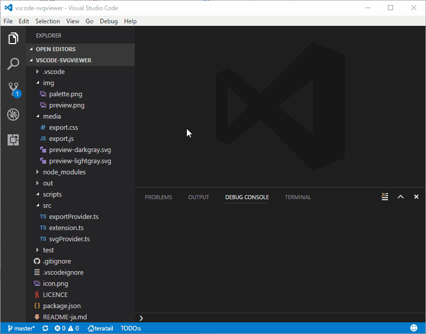
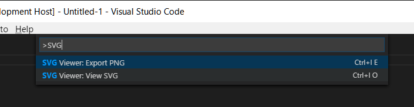
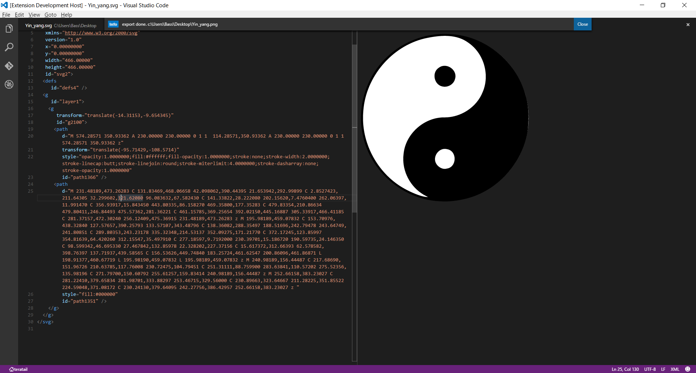

# vscode-svgviewer
SVG Viewer for Visual Studio Code
[Visual Studio Marketplace](https://marketplace.visualstudio.com/items/cssho.vscode-svgviewer)

[](https://marketplace.visualstudio.com/items?itemName=cssho.vscode-svgviewer)
[](https://marketplace.visualstudio.com/items?itemName=cssho.vscode-svgviewer)
[](https://marketplace.visualstudio.com/items?itemName=cssho.vscode-svgviewer)

## Easy way to preview
EXPLORERのコンテキストメニューからSVGをプレビューする


## Usage 
0. コマンドパレットを表示し、入力欄に`ext install SVG Viewer`と入力
0. Enterを押下し、VSCodeを再起動
0. SVGファイルを開く
0. コマンドパレットかショートカットから処理を選択



### View SVG - `Alt+Shift+S O`
SVGをエディタ上で表示

### Export PNG - `Alt+Shift+S E`
SVGをPNGに変換

### Export PNG with explicitly size - `Alt+Shift+S X`
サイズを明示的に指定して、SVGをPNGに変換

### Copy data URI scheme - `Alt+Shift+S C`
SVGをdata URI schemeに変換し、クリップボードにコピー

### View SVG and Export PNG by canvas - `Alt+Shift+S V`
表示と変換
Thanks @kexi



### Options
SVG Viewerでは以下のVisual Studio Codeの設定が可能です。`User Settings`または`Workspace Settings`で設定できます。

```javascript
{
    // 透明グリッドを表示
	"svgviewer.transparencygrid": true,    

    // プレビューを自動的に開く
    "svgviewer.enableautopreview": true,

    // プレビューの開き方を指定 (vscode.ViewColumn)
    "svgviewer.previewcolumn": "One"
}
```
